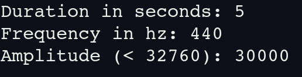

# Wav Generator

`Wav Generator` is a C++ program that generates a custom `.wav` file based on user-defined parameters. It creates a sine wave audio signal with a specified duration, frequency, and amplitude, and saves it as an `audio.wav` file.

## Features

- **User Input:**
  - Duration of the audio in seconds
  - Frequency of the sine wave in Hz
  - Amplitude of the sine wave (should be less than 32760)
- **Output:**
  - Generates a WAV file named `audio.wav` in the same directory.

## Requirements

- **C++ Compiler:** Ensure you have a C++ compiler installed, such as `g++`.
- **[makepp](https://github.com/shaalan-ahmed/makepp):** Used for project management and build automation.

## Installation

### 1. Clone the Repository

Clone this repository to your local machine and change to the project directory:

```bash
git clone https://github.com/shaalan-ahmed/Wav_Generator.git
cd Wav_Generator
```

## Try it!
### 1. Build and Run

To build and run the main.cpp file, navigate to the Commands directory and run the make.sh script:

```bash
cd Commands && ./make.sh
```

This will compile the project and prompt you to provide inputs for creating the .wav file as shown here:



Note: The amplitude must be less than 32760 because the value is stored in a 16-bit variable in the WAV file header, which can store values up to 32768. We subtract 8 as a precaution.

### 2. Result

After providing the inputs and pressing Enter, the `audio.wav`   file will be generated in the Audio folder.

## Note for the User

This project is still under development and may lack safety features such as input validation. New features will be added regularly.